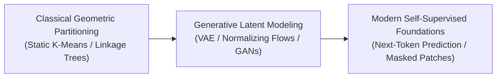

# Awesome-Unsupervised-Learning
## Unsupervised Learning: Evolution, Variants, Types, & Applications

Unsupervised Learning is a foundational machine learning paradigm where a model is trained on a dataset entirely devoid of human-annotated labels, target variables, or explicit guidance. The algorithm must independently explore the input data to identify hidden structures, clusters, statistical patterns, and low-dimensional representations. Over the history of AI, Unsupervised Learning has evolved from simple geometric clustering and statistical density modeling to the modern backbone of generative foundation AI, driving data compression, structural anomaly tracking, and self-directed semantic world modeling.

---

## 1. The Chronological Evolution

The technical progression of unsupervised learning has transitioned from rigid distance-based groupings to continuous latent variable modeling and unified web-scale self-supervised token systems.

| Era | Concept & Limitations | Year First Used | Key Paper |
| :--- | :--- | :--- | :--- |
| **The Classical Clustering & Association Era (Traditional ML)** | **Concept:** The structural baseline. Focused on partitioning data based on geometric proximity (e.g., **$K$-means**, Hierarchical Clustering) or discovering transactional rules (e.g., **Apriori Algorithm**).  **Limitation:** Rigidly dependent on pre-defined distance metrics (like Euclidean distance) and highly susceptible to the **Curse of Dimensionality**, causing performance to collapse on complex, high-dimensional arrays. | 1956 | [Sur la division des corps matériels en parties](https://doi.org/10.1007/BF02932525) (Steinhaus, 1956) |
| **The Deep Generative Latent Space Era (~2014–2021)** | **Concept:** Unlocked by deep neural networks capable of learning continuous latent variables. Frameworks like **Variational Autoencoders (VAEs)** and **Generative Adversarial Networks (GANs)** forced networks to map data distributions into compact, low-dimensional vector spaces, learning to synthesize completely novel data variants. | 2013 | [Auto-Encoding Variational Bayes](https://arxiv.org/abs/1312.6114) (Kingma & Welling, 2013) |
| **The Self-Supervised Foundation Era (~2021–Present)** | **Concept:** The current modern state-of-the-art paradigm. Unsupervised learning shifted into **Self-Supervised Learning (SSL)**, completely blurring the boundary between unsupervised and supervised methods. By dynamically mask-hiding text characters, image patches, or audio frames, the model creates its own dense pseudo-labels from raw data, building universal foundation models from unannotated data. | 2021 | [On the Opportunities and Risks of Foundation Models](https://arxiv.org/abs/2108.07258) (Bommasani et al., 2021) |

---

## 2. Core Functional & Algorithmic Variants

Unsupervised algorithms are strictly categorized based on how they process, map, and organize data spaces mathematically.

| Variant | Mechanism & Examples | Year First Used | Key Paper |
| :--- | :--- | :--- | :--- |
| **Clustering / Density Estimation** | **Mechanism:** Identifies discrete groupings or statistical density boundaries within the dataset. It maps data points into categories or calculates continuous probability distributions without prior class markers.  **Examples:** $K$-Means++, Gaussian Mixture Models (GMM), DBSCAN, and Density-Based Spectral cuts. | 1996 | [A Density-Based Algorithm for Discovering Clusters in Large Spatial Databases with Noise](https://www.aaai.org/Papers/KDD/1996/KDD96-037.pdf) (Ester et al., 1996) |
| **Dimensionality Reduction / Latent Space Projection** | **Mechanism:** Compresses high-dimensional vector spaces down into a highly dense, lower-dimensional manifold while preserving maximum physical variance or geometric relationships.  **Examples:** Principal Component Analysis (PCA), t-SNE, UMAP, and Deep Autoencoders. | 1901 | [On Lines and Planes of Closest Fit to Systems of Points in Space](https://doi.org/10.1080/14786440109462720) (Pearson, 1901) |
| **Association Rule Learning** | **Mechanism:** Discovers hidden relational dependencies and co-occurrence thresholds across massive database logs, tracking how the appearance of one attribute triggers the presence of another.  **Examples:** Apriori, ECLAT, and FP-Growth algorithms. | 1994 | [Fast Algorithms for Mining Association Rules](https://www.vldb.org/conf/1994/P487.PDF) (Agrawal & Srikant, 1994) |

---

## 3. High-Capacity Generative & Structural Manifestations

Modern deep unsupervised architectures use specialized loss functions and structural loops to model complex probability fields natively.

| Manifestation | Mechanism & Examples | Year First Used | Key Paper |
| :--- | :--- | :--- | :--- |
| **Contrastive Representation Matching** | **Mechanism:** Trains a dual-tower network to treat data parsing as a semantic alignment task. It uses data augmentation (e.g., cropping or rotating an image) to create positive pairs, applying the InfoNCE loss function to push positive pairs together while repelling negative pairs.  **Examples:** SimCLR, MoCo, and CLIP. | 2018 | [Representation Learning with Contrastive Predictive Coding](https://arxiv.org/abs/1807.03748) (Oord et al., 2018) |
| **Masked Autoencoding / Reconstruction** | **Mechanism:** Randomly deletes or blanks out up to 75% of incoming visual data patches or text words. The transformer core must exploit surrounding structural boundaries to mathematically reconstruct the original hidden pixels or tokens.  **Examples:** BERT (NLP) and Masked Autoencoders (MAE for Vision). | 2018 | [BERT: Pre-training of Deep Bidirectional Transformers for Language Understanding](https://arxiv.org/abs/1810.04805) (Devlin et al., 2018) |
| **Normalizing Flows / Flow Matching** | **Mechanism:** Maps complex, irregular real-world data distributions into clean, simple Gaussian fields through a sequence of invertible mathematical transformations.  **Examples:** RealNVP, Glow, and modern Flow-Matching Transformers. | 2016 | [Density estimation using Real NVP](https://arxiv.org/abs/1605.08803) (Dinh et al., 2016) |

---

## 4. Production Engineering Challenges & Mitigations

Deploying unsupervised pipelines into enterprise MLOps architectures requires balancing evaluation thresholds and structural stability locks.

| Challenge | Problem & Mitigation | Year First Used | Key Paper |
| :--- | :--- | :--- | :--- |
| **The Representation Space Collapse Threat** | **The Problem:** In deep unsupervised autoencoders or contrastive loops, the model can discover a trivial, mathematically useless solution: mapping all input variations to a single, static constant vector (e.g., outputting all zeros), completely halting the learning process.  **Mitigation:** Implementing **asymmetric networks** (adding a predictor block to only one side), enforcing strict **stop-gradients**, or applying **variance-covariance regularization (VICReg / Barlow Twins)** to force full tensor dimension utilization. | 2021 | [Barlow Twins: Self-Supervised Learning via Redundancy Reduction](https://arxiv.org/abs/2103.03230) (Zbontar et al., 2021) |
| **The Validation Lack Bottleneck (Evaluation Deficit)** | **The Problem:** Because there are no ground-truth target labels, calculating a definitive, objective accuracy score to evaluate whether model model update A is better than model update B is highly volatile.  **Mitigation:** Employing statistical proxies—like the **Silhouette Coefficient** or **Davies-Bouldin Index** for clustering, and **Fréchet Inception Distance (FID)** or downstream task linear-probing for deep generative models. | 1987 | [Silhouettes: A graphical aid to the interpretation and validation of cluster analysis](https://doi.org/10.1016/0377-0427(87)90125-7) (Rousseeuw, 1987) |

---

## 5. Frontier Real-World AI Applications

| Application Field | Description | Year First Used | Key Paper |
| :--- | :--- | :--- | :--- |
| **Universal Multi-Modal Base Model Pre-Training** | **Application:** Serves as the core initial training engine for modern frontier LLMs and vision-language networks. Unsupervised next-token prediction over trillions of uncurated web lines allows the model to naturally internalize world facts, grammar syntax, and cross-modal reasoning concepts. | 2021 | [Learning Transferable Visual Models From Natural Language Supervision](https://arxiv.org/abs/2103.00020) (Radford et al., 2021) |
| **Enterprise Cyber-Security & Fraud Anomaly Tracking** | **Application:** Scans millions of high-frequency banking or server transaction logs in real time. Unsupervised isolation forests or deep reconstruction autoencoders model the parameters of "normal" system behaviors, instantly flagging hidden cyber-attacks or laundering vectors if an execution deviates from the learned manifold. | 2008 | [Isolation Forest](https://doi.org/10.1109/ICDM.2008.17) (Liu et al., 2008) |
| **Industrial Bio-Informatics & Genetic Sequence Discovery** | **Application:** Maps unannotated DNA, RNA, or protein peptide sequences spanning billions of elements. Unsupervised clustering taxomomies and deep autoencoding layers group complex molecules by structural geometry, accelerating de novo drug discovery and tracking evolutionary mutations efficiently. | 2021 | [Biological structure and function emerge from scaling unsupervised learning to 250 million protein sequences](https://doi.org/10.1073/pnas.2016239118) (Rives et al., 2021) |

