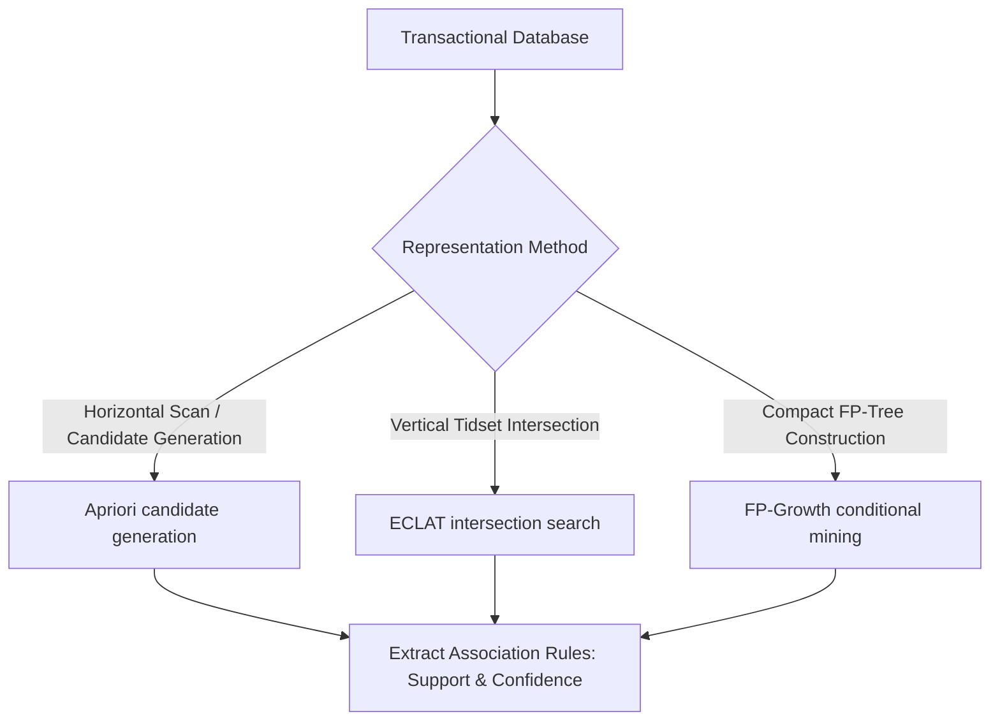

# Association Rule Learning

Association rule learning is a rule-based machine learning method for discovering interesting relationships (co-occurrences) between variables in large databases.

## Core Algorithms

### 1. Apriori
Uses a bottom-up approach where frequent subsets are extended one item at a time (candidate generation). It applies the "downward closure property": any subset of a frequent itemset must also be frequent.

### 2. ECLAT (Equivalence Class Transformation)
Uses a depth-first search based on transaction ID sets (tidsets) intersection to find frequent itemsets, avoiding candidate generation.

### 3. FP-Growth (Frequent Pattern Growth)
Represents the database in a compact tree structure called an FP-Tree. It mine the tree directly without generating candidates, which makes it significantly faster than Apriori.

## Association Rule Mining Flow

[← Back to README](../README.md)
