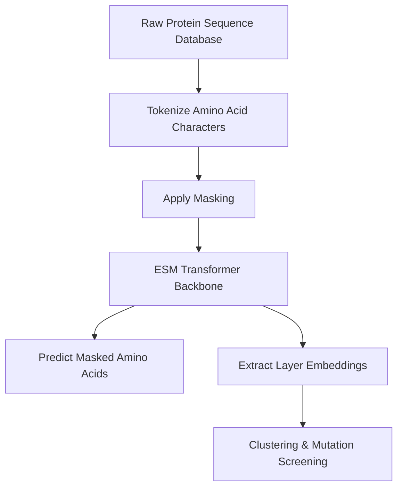

# Industrial Bio-Informatics & Genetic Sequence Discovery

Applying self-supervised pre-training to evolutionary biology allows algorithms to learn complex physical structures and biochemical properties directly from sequence data.

## Bio-Informatics Applications

- **Protein Language Models (e.g., ESM)**: Trains Transformer encoders on millions of raw, unannotated protein sequences using masked language modeling. The model learns:
  - Secondary and tertiary protein structures.
  - Biochemical binding sites.
  - Evolutionary mutations.
- **Genetic Manifold Embedding**: Maps high-dimensional genomic variants down to lower-dimensional spaces to track disease susceptibility clusters.
- **De Novo Molecule Design**: Generates novel molecular structures with targeted binding properties using generative networks trained on chemical databases.

## Protein Sequence Learning Pipeline

[← Back to README](../README.md)
