# Classical Clustering & Association Era (Traditional ML)

The foundation of unsupervised learning began with distance-based geometric clustering and association rule mining, relying entirely on structured mathematical equations rather than deep networks.

## Core Concepts

- **K-Means Clustering**: Partitions $N$ observations into $K$ clusters in which each observation belongs to the cluster with the nearest mean (cluster centroid), acting as a prototype.
- **Hierarchical Clustering**: Builds a tree (dendrogram) of clusters either bottom-up (agglomerative) or top-down (divisive) based on linkage criteria.
- **Apriori Algorithm**: Used for frequent itemset mining and association rule learning over transactional databases to find patterns of co-occurrence.

## Limitations
- Highly vulnerable to the **Curse of Dimensionality**.
- Heavily dependent on the choice of distance metrics (e.g., Euclidean distance).

## Workflow Diagram

```mermaid
flowchart TD
    RawData[Raw Input Data] --> Metric{Distance Metric Selected}
    Metric -->|Euclidean / Manhattan| Clustering[Geometric Clustering]
    Metric -->|Support / Confidence| Association[Association Rule Mining]
    Clustering --> KMeans[K-Means Partitioning]
    Clustering --> Hierarchical[Hierarchical Dendrogram]
    Association --> Apriori[Apriori Frequent Itemsets]
```

[← Back to README](../README.md)
