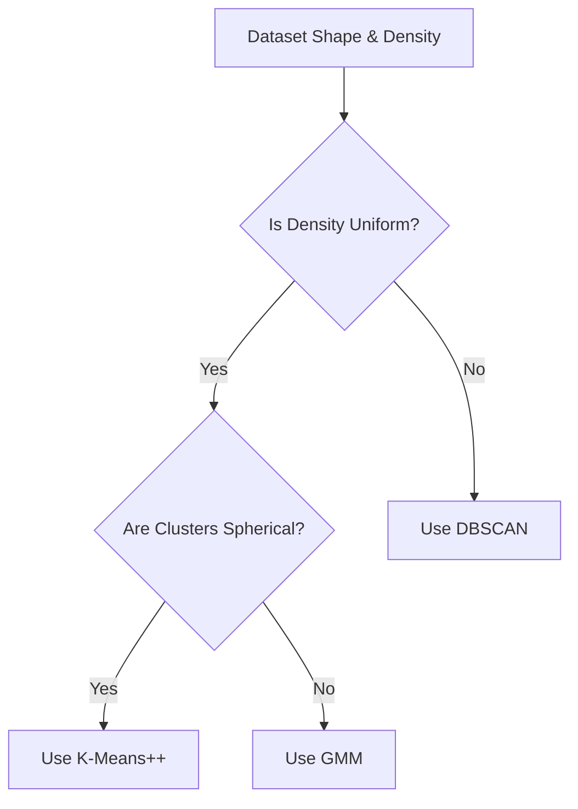

# Clustering & Density Estimation

Clustering and Density Estimation algorithms analyze unlabeled data to identify discrete boundaries, continuous probability distributions, or spatial groupings.

## Core Methods

### 1. K-Means++ Seeding
Improves K-Means by initializing centroids far away from each other based on a probability distribution proportional to the square of the distance to the nearest existing centroid.

### 2. Gaussian Mixture Models (GMM)
A probabilistic model assuming all data points are generated from a mixture of a finite number of Gaussian distributions with unknown parameters, optimized using the Expectation-Maximization (EM) algorithm.

### 3. DBSCAN (Density-Based Spatial Clustering of Applications with Noise)
Groups points close to each other based on distance and minimum density, marking outliers in low-density regions as noise.

## Decision Flowchart

[← Back to README](../README.md)
