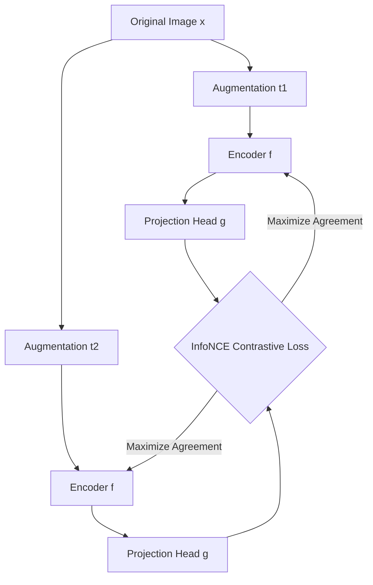

# Contrastive Representation Matching

Contrastive learning is a self-supervised method that teaches models to distinguish between similar (positive) and dissimilar (negative) pairs of data.

## Key Concepts

- **Data Augmentations**: Creating multiple views of the same sample (e.g., crop, flip, color jitter).
- **InfoNCE Loss**: A noise-contrastive estimation loss that acts as a multi-class categorical cross-entropy loss, pulling positive views together while pushing negative views apart in embedding space.
- **Frameworks**:
  - **SimCLR**: Simple framework using large batch sizes and a projection head.
  - **MoCo**: Momentum contrast using a queue of negative keys and a momentum encoder.
  - **CLIP**: Multimodal contrastive learning matching images to captions.

## SimCLR Pipeline Diagram

[← Back to README](../README.md)
