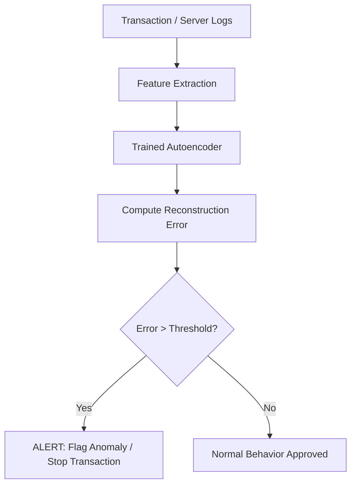

# Enterprise Cyber-Security & Fraud Anomaly Tracking

Unsupervised learning is a critical asset in cybersecurity and fraud detection because normal transactions outnumber anomalies by orders of magnitude, making supervised labeling highly impractical.

## Detection Strategies

- **Isolation Forest**: Isolates anomalies by randomly selecting a feature and then randomly selecting a split value between the maximum and minimum values. Anomalies require fewer random splits to isolate than normal points.
- **Reconstruction-based Autoencoders**: An autoencoder is trained exclusively on normal transaction/system logs. When presented with anomalous data (e.g., a cyber attack), it struggles to reconstruct it, resulting in a high reconstruction error (anomaly score).
- **One-Class SVM / Elliptic Envelope**: Defines a robust boundary representing normal operational states.

## Anomaly Detection Flow

[← Back to README](../README.md)
