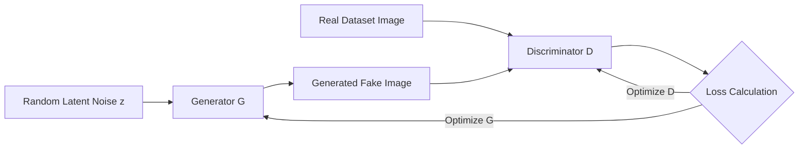

# The Deep Generative Latent Space Era (~2014–2021)

This era unlocked continuous latent variable representations using deep neural networks, enabling models to not only categorize data but synthesize entirely new samples.

## Key Architectures

### 1. Variational Autoencoders (VAEs)
Introduced a probabilistic twist to traditional autoencoders. Instead of mapping inputs directly to a fixed latent code, VAEs map inputs to parameters of a probability distribution (mean $\mu$ and variance $\sigma$), regularizing the latent space via Kullback-Leibler (KL) divergence to ensure smooth interpolation.

### 2. Generative Adversarial Networks (GANs)
Formulates generative modeling as a minimax two-player game:
- **Generator ($G$)**: Learns to create realistic data from random noise.
- **Discriminator ($D$)**: Learns to distinguish between real data and generated (fake) data.

## GAN Architecture Diagram

[← Back to README](../README.md)
