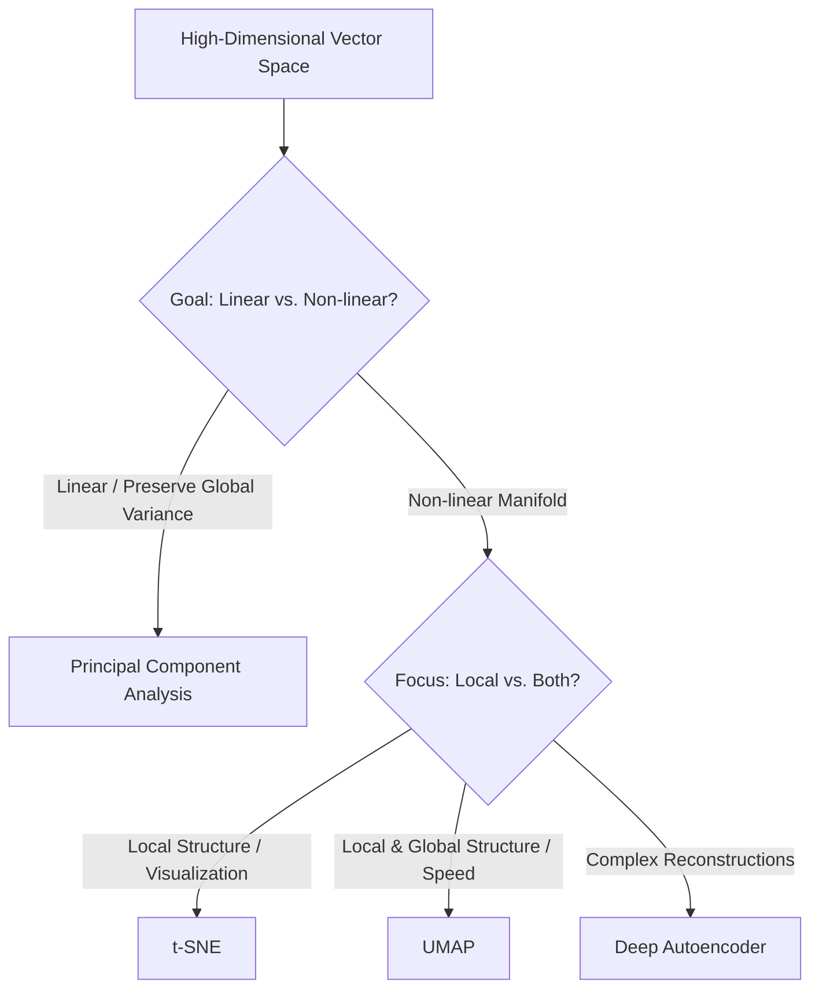

# Dimensionality Reduction & Latent Space Projection

Dimensionality reduction maps high-dimensional datasets down to low-dimensional manifolds while preserving properties like variance, pairwise distances, or topological structure.

## Algorithms

- **Principal Component Analysis (PCA)**: A linear method that identifies orthogonal directions of maximum variance (principal components) using Singular Value Decomposition (SVD).
- **t-SNE (t-Distributed Stochastic Neighbor Embedding)**: A non-linear method that maps pairwise similarities in high dimensions to Student-t distributions in low dimensions.
- **UMAP (Uniform Manifold Approximation and Projection)**: A non-linear method rooted in Riemannian geometry and algebraic topology, preserving both local and global structure more efficiently than t-SNE.
- **Deep Autoencoders**: Neural networks designed to compress data through a bottleneck layer (encoder) and reconstruct it (decoder).

## Projection Type Flow

[← Back to README](../README.md)
