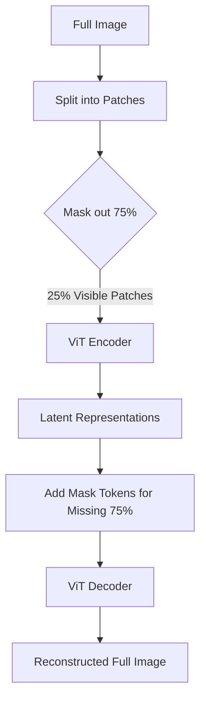

# Masked Autoencoding & Reconstruction

Masked Autoencoding is a self-supervised task where a model learns by reconstructing corrupted or missing parts of its input.

## Key Architectures

### 1. BERT (Bidirectional Encoder Representations from Transformers)
In natural language processing, BERT randomly masks 15% of the input tokens and trains the model to predict the masked tokens based on both left and right context.

### 2. MAE (Masked Autoencoders for Vision)
In computer vision, MAE masks a very high percentage of image patches (typically 75%). The encoder only processes the remaining visible patches, after which dummy "mask tokens" are appended and fed into a lightweight decoder to reconstruct the original pixels.

## MAE Vision Pipeline

[← Back to README](../README.md)
