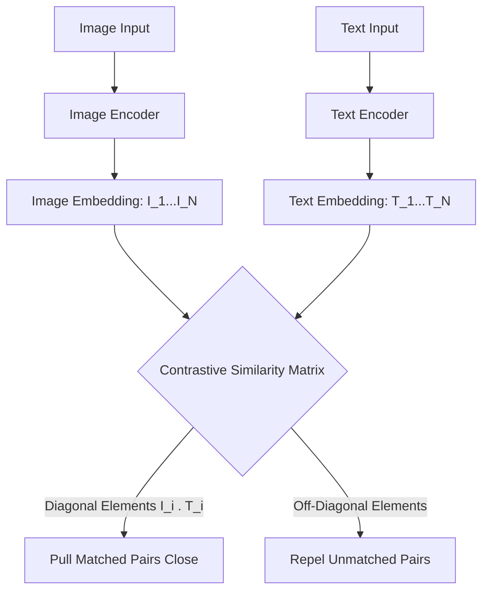

# Universal Multi-Modal Base Model Pre-Training

Pre-training models on multi-modal datasets (e.g., text, images, audio) using self-supervised objectives enables the model to align disparate sensory concepts in a single, unified vector space.

## Key Methods

- **Contrastive Language-Image Pretraining (CLIP)**: Uses dual-tower encoders (image encoder + text encoder) to maximize the cosine similarity of matched image-caption pairs while minimizing unmatched pairs.
- **Autoregressive Language Pretraining**: Predicts the next token given a sequence of multi-modal tokens (e.g., text and image patch tokens combined).
- **Masked Multi-Modal Modeling**: Randomly masks out elements of text or regions of images, forcing cross-modal prediction.

## Alignment Matrix Diagram

[← Back to README](../README.md)
