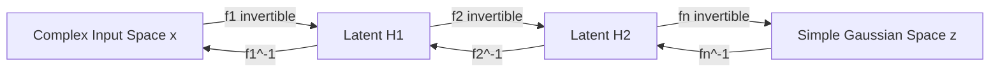

# Normalizing Flows & Flow Matching

Normalizing flows construct complex probability distributions by mapping a simple base distribution (such as a standard Gaussian) through a series of bijective, invertible, and differentiable transformations.

## Core Models

- **RealNVP (Real-valued Non-Volume Preserving)**: Uses affine coupling layers to construct invertible maps where the Jacobian determinant is triangular and cheap to compute.
- **Glow**: Introduces $1 \times 1$ invertible convolutions, simplifying the network architecture and scaling to high-resolution image generation.
- **Flow Matching**: A newer likelihood-free generative method that directly regresses vector fields to match target distributions, showing faster training convergence than diffusion models.

## Bijective Mapping Diagram

[← Back to README](../README.md)
