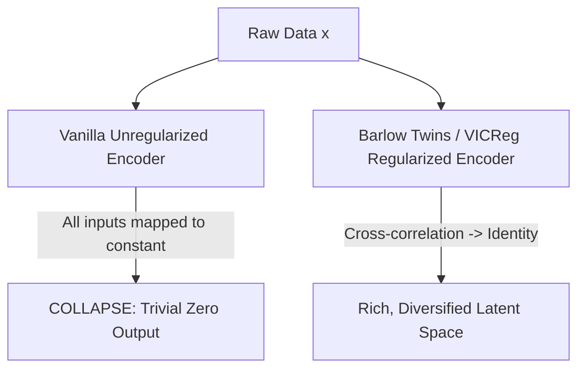

# The Representation Space Collapse Threat

A fundamental risk in deep unsupervised representation learning is **representation collapse**, where a neural network maps all inputs to a single, constant representation (e.g., all zeros), rendering the learned space useless.

## Prevention Techniques

### 1. Asymmetric Architectures (BYOL / SimSiam)
Introduces a predictor network on only one branch of a dual-tower network, combined with a **stop-gradient** operator on the other branch. This asymmetry breaks the mathematical equilibrium of collapse.

### 2. Variance-Covariance Regularization (VICReg)
Applies direct regularizers to the embeddings:
- **Variance**: Prevents collapse by forcing the standard deviation of embeddings along each dimension to be above a threshold.
- **Covariance**: Prevents redundancy by forcing the covariance between different dimensions of the embedding to be zero.

### 3. Redundancy Reduction (Barlow Twins)
Forces the cross-correlation matrix between outputs of two identical branches (representing different augmentations of the same input) to be close to the identity matrix.

## Collapse vs. Regularized Embedding Flow

[← Back to README](../README.md)
