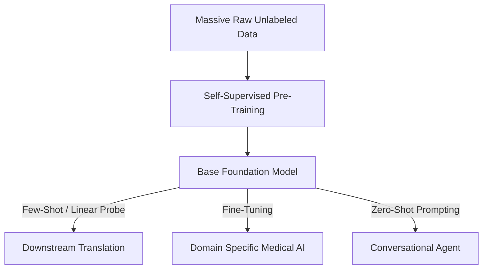

# The Self-Supervised Foundation Era (~2021–Present)

Modern state-of-the-art AI is powered by large self-supervised models. By constructing proxy tasks directly from raw, unlabeled datasets, models build generalist representations adaptable to almost any downstream task.

## Key Mechanisms

- **Self-Supervised Learning (SSL)**: Eliminates manual labeling by automatically generating labels from the data structure itself (e.g., predicting the next word, predicting masked patches).
- **Transformer Scaling**: Utilizes attention mechanisms to process high-volume datasets across text, vision, and audio.
- **Foundation Models**: Extremely large models trained on vast web-scale datasets that serve as the base model for specific domain fine-tuning.

## Pre-training and Adaptation Flow

[← Back to README](../README.md)
