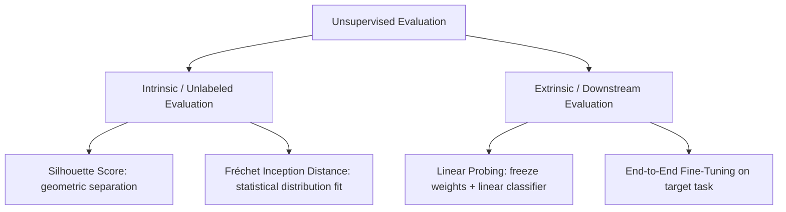

# The Validation Lack Bottleneck (Evaluation Deficit)

Unsupervised learning lacks ground-truth labels, which makes calculating objective validation scores (like accuracy or F1-score) during training extremely difficult.

## Evaluation Proxies

### 1. Intrinsic Evaluation (Geometric & Statistical)
- **Silhouette Coefficient**: Measures how close a point is to its own cluster compared to other clusters (cohesion vs. separation).
- **Davies-Bouldin Index**: Calculates the average similarity ratio of each cluster with its most similar cluster. Lower scores indicate better separation.
- **Fréchet Inception Distance (FID)**: Calculates the Wasserstein-2 distance between two Gaussians fitted to feature representations of generated vs. real image sets.

### 2. Extrinsic Evaluation (Downstream Performance)
- **Linear Probing**: Freezes the unsupervised model backbone, trains a linear classifier on top using labels, and measures accuracy.
- **Fine-tuning**: Adapts all parameters of the pre-trained model on a target dataset.

## Evaluation Taxonomy

[← Back to README](../README.md)
